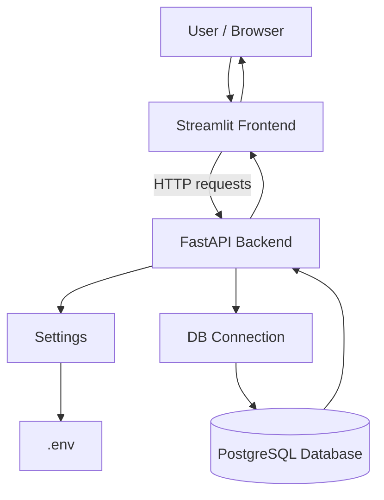
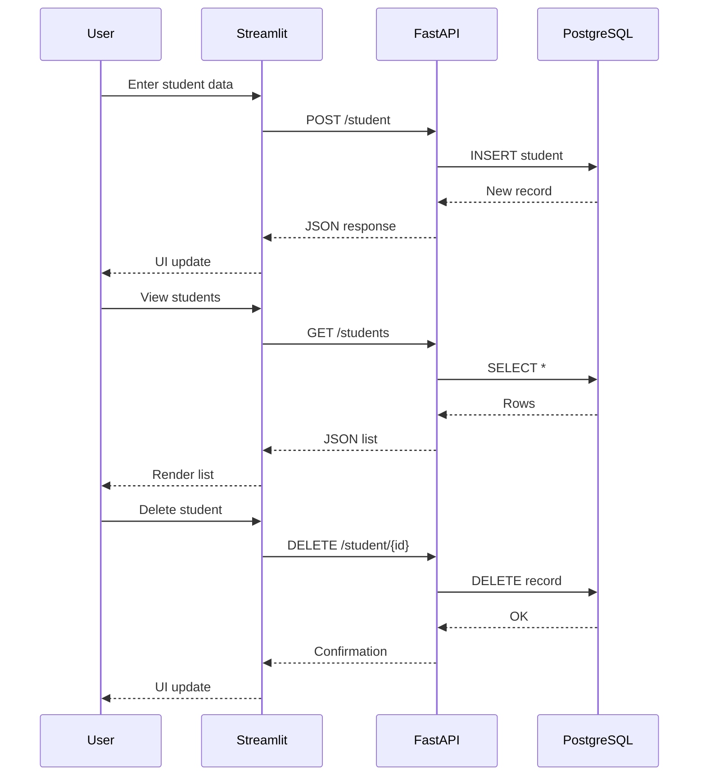
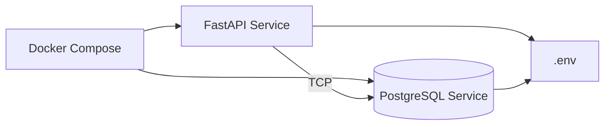

# University API

A simple yet production‑style **University API** modern full‑stack backend application using **FastAPI** with a **PostgreSQL** database, orchestrated with **Docker Compose**, and complemented by a lightweight **Streamlit** frontend.

---

## 🎯 Project Goals

The main goals of this project are:

* Learn **FastAPI** fundamentals and REST API design
* Connect FastAPI to **PostgreSQL** using `psycopg2`
* Manage database schema with simple migration scripts
* Write automated API tests with **pytest**
* Run the application locally and inside **Docker Compose**
* Build a minimal **Streamlit** UI as a frontend client

This project follows best practices expected in backend development, namely the Test-Driven Development (TDD), software development approach where you write automated tests before writing the actual code, then implement just enough code to make those tests pass.
It follows a short cycle of red (failing test) → green (passing test) → refactor, helping ensure correctness, cleaner design, and easier maintenance.

---

## 🧰 Tech Stack

* **Python 3.12**
* **FastAPI** – backend REST API
* **PostgreSQL** – relational database
* **psycopg2** – PostgreSQL driver
* **Pydantic** – data validation and settings management
* **pytest** – automated testing
* **Docker & Docker Compose** – containerization and service orchestration
* **Streamlit** – simple web UI for interacting with the API

---

## 📁 Project Structure

```text
university_api/
├── app/
│   ├── main.py              # FastAPI application
│   ├── db.py                # Database connection helper
│   ├── config.py            # Application settings (.env support)
│   ├── models/
│   │   └── student.py       # Pydantic models
│   └── migrations/
│       ├── migrations_create_tables.py
│       ├── migrations_clear_db.py
│       └── migrations_connection.py
│
├── streamlit/
│   └── main.py              # Streamlit frontend
│
├── tests/
│   └── test_main.py         # API tests
│
├── Dockerfile
├── docker-compose.yml
├── requirements.txt
├── .gitignore
├── .dockerignore
└── README.md
```

---

## 🏗️ Architecture Overview



---

## 🔄 Request Flow (Sequence Diagram)



---

## 🐳 Docker Compose Architecture



Docker Compose manages:

* **FastAPI container** (application logic)
* **PostgreSQL container** (persistent database)
* Shared environment variables via `.env`

---

## ⚙️ Environment Variables

Create a `.env` file in the project root:

```env
DATABASE_HOST=localhost
DATABASE_PORT=5432
DATABASE_NAME=university_api_db
DATABASE_USER=university_api_user
DATABASE_PASSWORD=university_api_password
```

---

## ▶️ Running the Project Locally

```bash
python -m venv .venv
source .venv/bin/activate   # Linux / macOS
.venv\Scripts\Activate.ps1  # Windows (PowerShell)

pip install -r requirements.txt

python -m app.migrations.migrations_create_tables
uvicorn app.main:app --reload --port 8080
```

API documentation will be available at:

* [http://localhost:8080/docs](http://localhost:8080/docs)

---

## 🖥 Streamlit Frontend

Run the Streamlit UI in a separate terminal:

```bash
streamlit run streamlit/main.py
```

The application will open automatically in your browser.

---

## 🧪 Running Tests

```bash
pytest
```

Tests cover:

* API availability
* Student creation
* Retrieving student list
* Deleting students

---

## 🐳 Running with Docker Compose

Build and start all services:

```bash
docker compose up --build
```

This command starts:

* FastAPI backend service
* PostgreSQL database service

---

## 📌 API Endpoints Overview

| Method | Endpoint        | Description          |
| ------ | --------------- | -------------------- |
| GET    | `/`             | Root endpoint        |
| GET    | `/status`       | Health check         |
| POST   | `/student/`     | Create a student     |
| GET    | `/students/`    | Get all students     |
| DELETE | `/student/{id}` | Delete student by ID |

---

